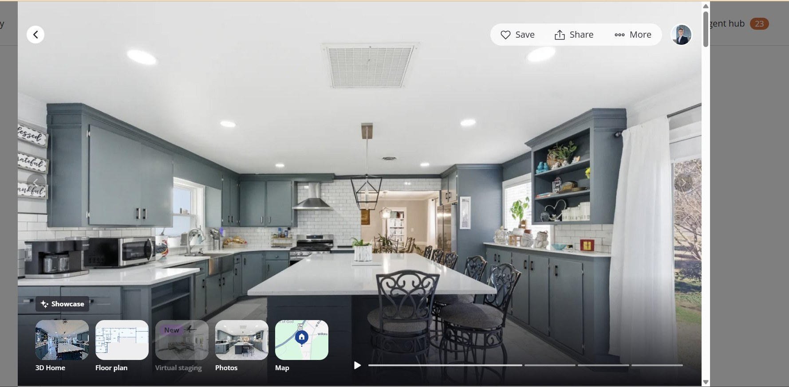
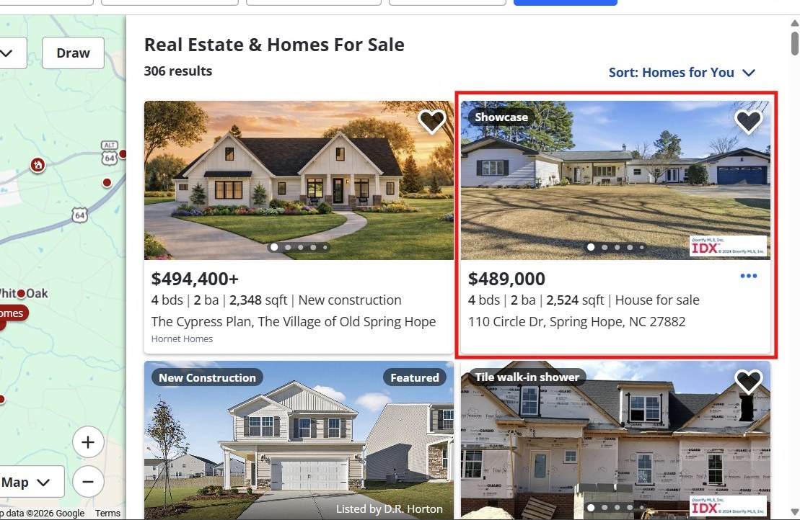

<!DOCTYPE html>
<html lang="en">
<head>
<meta charset="UTF-8">
<meta name="viewport" content="width=device-width, initial-scale=1.0">
<title>Sold Strategy — Alden Lawrence</title>
<link href="https://fonts.googleapis.com/css2?family=Cormorant+Garamond:ital,wght@0,400;0,600;0,700;1,400;1,700&family=Montserrat:wght@300;400;500;600&display=swap" rel="stylesheet">
<link rel="stylesheet" href="style.css">
</head>
<body>

<!-- NAV -->
<nav>
  <div class="nav-left">
    <div class="nav-mono">AL</div>
    <div class="nav-rule"></div>
    <div class="nav-name">Alden Lawrence</div>
  </div>
  <div class="nav-contact">919-737-4534 &nbsp;·&nbsp; LPT Realty</div>
</nav>

<!-- HERO -->
<div style="background:var(--black);padding:5rem 4rem;display:grid;grid-template-columns:1fr 1fr;align-items:center;gap:4rem;min-height:88vh;" class="hero">
  <div>
    <p class="hero-eyebrow">Sold Strategy · Pre-Listing Presentation</p>
    <h1 class="hero-headline">When you hire<br>Alden, <em>you are<br>moving.</em></h1>
    <p class="hero-sub">I've sold 97% of my listings — and for those that sold, I averaged 98.7% of list price. Here is exactly how I'll do it for you, and why the decisions we make before day one make all the difference.</p>
    <a href="tel:9197374534" class="hero-cta">Schedule a free consultation</a>
  </div>
  <div>
    <div class="stat-row">
      <div class="stat-cell"><div class="stat-num">97%</div><div class="stat-lbl">Of listings sold</div></div>
      <div class="stat-cell"><div class="stat-num">98.7%</div><div class="stat-lbl">Avg. list-to-sale price ratio</div></div>
      <div class="stat-cell"><div class="stat-num">4×</div><div class="stat-lbl">Faster than the average agent</div></div>
      <div class="stat-cell"><div class="stat-num">93+</div><div class="stat-lbl">Clients helped buy &amp; sell</div></div>
    </div>
  </div>
</div>

<!-- ABOUT -->
<section class="gray">
  <p class="eyebrow">About Alden</p>
  <div class="about-grid">
    
    <div>
      <h2 class="section-headline" style="font-size:36px;">Born here. Raised here.<br>Invested in this market.</h2>
      <div class="rule"></div>
      <div class="about-body">
        <p>Selling your home is one of the biggest financial decisions you'll make, and you deserve an agent who treats it that way.</p>
        <p>I'm Alden Lawrence, a licensed Realtor serving Hampton, VA, the Outer Banks, and the communities around Elizabeth City, NC, where I was born and raised. I know these markets the way only someone who grew up in them can. Every neighborhood, every backroad, every hidden gem.</p>
        <p>After seven years helping clients buy and sell in the competitive Raleigh market, I came back home to build something here. Since then I've helped 93+ clients through one of the biggest transactions of their lives. I don't take that lightly.</p>
        <p>What separates me from other agents isn't just the results. It's that every client gets my full attention, honest advice, and someone who will fight for them at every step of the process.</p>
        <p>When I'm not working, you'll find me on the jiu-jitsu mats, at the poker table, or buried in a book.</p>
      </div>
      <div class="about-detail">
        <div class="about-detail-item">Licensed Realtor · LPT Realty, LLC</div>
        <div class="about-detail-item">NCREC #291701 · VA #0225270378</div>
        <div class="about-detail-item">Serving Hampton, VA · Outer Banks, NC · Elizabeth City, NC</div>
      </div>
    </div>
  </div>
</section>

<!-- PRICING -->
<section class="dark">
  <div class="pricing-inner">
    <p class="eyebrow light">The single most important decision</p>
    <h2 class="section-headline light">Price it right from day one —<br><em>or pay the price later.</em></h2>
    <div class="rule light"></div>
    <p class="pricing-body">Most agents will tell you what you want to hear about price just to win your listing. I'll tell you the truth — because the truth is what gets you the most money at the closing table.</p>
    <div class="analogy-box">
      <p class="analogy-label">Think of it this way</p>
      <p class="analogy-text">Imagine a restaurant that opens on a Friday night with the wrong menu and the wrong prices. By Tuesday, people are walking past saying <strong>"that place is always empty — something must be wrong with it."</strong> Even if they fix everything Wednesday, the reputation sticks. <strong>Your home works the same way.</strong> The first two weeks on market are your grand opening. Price it wrong and buyers won't come back — they'll assume something is wrong with the house. That perception is almost impossible to recover from, and it costs sellers thousands.</p>
    </div>
    <div class="stat-compare">
      <div class="stat-compare-cell bad">
        <div class="compare-num bad">87%</div>
        <div class="compare-lbl">Of list price — what overpriced homes average after sitting 120+ days and taking multiple price cuts</div>
      </div>
      <div class="stat-compare-cell good">
        <div class="compare-num good">97%+</div>
        <div class="compare-lbl">Of list price — what correctly priced homes average, selling in under 45 days</div>
      </div>
    </div>
  </div>
</section>

<!-- ZILLOW SHOWCASE -->
<div class="showcase-opening">
  <div>
    <p class="eyebrow light">Exclusive marketing advantage</p>
    <h2 class="section-headline light" style="margin-bottom:0;">Your home gets the<br><em>experience buyers<br>remember.</em></h2>
  </div>
  <div>
    <p class="showcase-body">Most agents list your home and hope buyers notice it. Through LPT Realty's preferred partnership with Zillow, every listing I take gets priority placement on America's #1 home search — with a full-screen, immersive experience that makes buyers fall in love before they ever walk through the door. Most agents don't have access to this.</p>
    <div class="badge-pill"><div class="badge-dot"></div>Zillow Showcase Partner</div>
  </div>
</div>

<div class="screen-block">
  <div class="frame-label">The immersive Showcase experience — what buyers see inside your listing</div>
  
  <div class="ann-bar">
    <div class="ann-cell"><div class="ann-tick"></div><div class="ann-tag">Showcase badge</div><div class="ann-desc">Signals to every buyer this is a premium listing — before they even click through</div></div>
    <div class="ann-cell"><div class="ann-tick"></div><div class="ann-tag">Full-screen photos</div><div class="ann-desc">Edge-to-edge imagery — not a thumbnail. Your home's first impression commands the screen</div></div>
    <div class="ann-cell"><div class="ann-tick"></div><div class="ann-tag">3D · Floor plan · Staging</div><div class="ann-desc">Buyers explore every room and visualize living there — before they ever schedule a visit</div></div>
    <div class="ann-cell"><div class="ann-tick"></div><div class="ann-tag">Video walkthrough</div><div class="ann-desc">An emotionally compelling video plays directly in the listing — something no standard listing has</div></div>
  </div>
</div>

<div class="sc-stat-strip">
  <div class="sc-strip-cell"><div class="sc-strip-num">200M+</div><div class="sc-strip-lbl">Monthly visitors on Zillow actively searching for homes</div></div>
  <div class="sc-strip-cell"><div class="sc-strip-num">#1</div><div class="sc-strip-lbl">Search placement — above every standard listing in your market</div></div>
  <div class="sc-strip-cell"><div class="sc-strip-num">2×</div><div class="sc-strip-lbl">More saves, views, and shares than comparable standard listings</div></div>
</div>

<div class="screen-block">
  <div class="frame-label">Priority placement in real Zillow search results — no mockup, this is the actual feed</div>
  
  <div class="ann-bar-2">
    <div class="ann-cell"><div class="ann-tick"></div><div class="ann-tag">Standard listing</div><div class="ann-desc">No badge. No priority. Gets the same treatment as every other listing in the feed — buried alongside hundreds of others, competing on price alone</div></div>
    <div class="ann-cell" style="border-left:1px solid rgba(0,106,255,0.15);"><div class="ann-tick" style="background:rgba(0,106,255,0.6);"></div><div class="ann-tag" style="color:#6BA5FF;">Showcase listing — listed by Alden</div><div class="ann-desc">The Showcase badge puts this listing at the top of the feed. More buyers see it first, more buyers click, more buyers show up ready to make an offer</div></div>
  </div>
</div>

<div class="sc-exclusive">
  <div class="excl-left">
    <div class="excl-title">Most agents don't offer this — because most don't have access to it.</div>
    <div class="excl-body" style="margin-top:0.75rem;">Through LPT Realty's preferred partnership with Zillow, I'm able to include Showcase on every listing I take — at no extra cost to you. Priority placement, the full immersive experience, the video walkthrough — all of it, included. It's not an add-on. It's just how I list every home.</div>
  </div>
  <div class="excl-right">
    <div class="excl-quote">"Before you sign with anyone, ask them: do you use Zillow Showcase on every listing?"</div>
    <div class="excl-body" style="margin-bottom:1.5rem;">Most won't be able to say yes. And that means your home starts at a disadvantage on the platform where 200 million buyers are actively searching — from day one, before a single showing is booked.</div>
    <a href="https://www.zillow.com/homedetails/110-Circle-Dr-Spring-Hope-NC-27882/216869628_zpid/" target="_blank" class="excl-link">See a live Showcase listing →</a>
  </div>
</div>
<div class="sc-pad-bottom"></div>

<!-- MARKETING BLITZ -->
<section class="gray">
  <p class="eyebrow">What I do from day one</p>
  <h2 class="section-headline">The 10-day<br><em>marketing blitz.</em></h2>
  <div class="rule"></div>
  <div class="marketing-grid">
    <div class="mkt-item"><div class="mkt-num">01</div><div class="mkt-title">Professional photography + drone video</div><div class="mkt-desc">30+ professional photos and aerial drone footage — your home's most compelling first impression, guaranteed.</div><div class="mkt-badge">Pre-launch</div></div>
    <div class="mkt-item"><div class="mkt-num">02</div><div class="mkt-title">Zillow Showcase + MLS syndication</div><div class="mkt-desc">Priority placement on Zillow plus syndication to Realtor.com, Homes.com, and 12,000+ real estate websites within 24 hours.</div><div class="mkt-badge">Day 1</div></div>
    <div class="mkt-item"><div class="mkt-num">03</div><div class="mkt-title">250+ buyer outreach calls per week</div><div class="mkt-desc">I actively prospect for your buyer every week through my nationwide network of Realtors, investors, and active buyers. I don't sit and wait.</div><div class="mkt-badge">Ongoing</div></div>
    <div class="mkt-item"><div class="mkt-num">04</div><div class="mkt-title">Email blast to top 100 buyer agents</div><div class="mkt-desc">Direct outreach to the most active buyer's agents in your market the day you go live — before most buyers even see the listing.</div><div class="mkt-badge">Day 1</div></div>
    <div class="mkt-item"><div class="mkt-num">05</div><div class="mkt-title">Open house + neighborhood outreach</div><div class="mkt-desc">Every homeowner in your neighborhood is personally contacted. Open house Sat/Sun 1–4pm the first weekend. Your neighbors know buyers.</div><div class="mkt-badge">Weekend 1</div></div>
    <div class="mkt-item"><div class="mkt-num">06</div><div class="mkt-title">Weekly showing reports + strategy calls</div><div class="mkt-desc">Feedback from every showing, plus a scheduled call each week to review market activity, buyer feedback, and adjust strategy if needed.</div><div class="mkt-badge">Weekly</div></div>
  </div>
</section>

<!-- EXIT GUARANTEE -->
<section class="dark">
  <div class="exit-inner">
    <div class="exit-big">EXIT</div>
    <div>
      <p class="eyebrow light">The easy exit guarantee</p>
      <h2 class="section-headline light">No long-term contracts.<br>No pressure. <em>Ever.</em></h2>
      <div class="rule light"></div>
      <p class="exit-body">Unlike most agents, I don't lock you into anything. I believe I need to earn your business every single day I work for you. If you're ever unhappy with the service I'm providing — for any reason — just say the word and we part as friends, no fees, no obligation. I'm confident enough in my results that I don't need a contract to keep you.</p>
    </div>
  </div>
</section>

<!-- COMMITMENTS -->
<section>
  <p class="eyebrow">My commitments to you</p>
  <h2 class="section-headline">What you can always<br><em>expect from me.</em></h2>
  <div class="rule"></div>
  <div class="commit-grid">
    <div class="commit-item"><div class="commit-title">Always in your best interest</div><div class="commit-desc">I will always do what is right for you — even when it's not what's easiest for me. Your outcome is my priority.</div></div>
    <div class="commit-item"><div class="commit-title">Responsive — always</div><div class="commit-desc">Phone calls, texts, emails — returned fast. You will never have to chase me down for an update on your home.</div></div>
    <div class="commit-item"><div class="commit-title">Fight for every dollar</div><div class="commit-desc">Every offer, every inspection item, every appraisal gap — I negotiate hard to protect your net proceeds at every turn.</div></div>
    <div class="commit-item"><div class="commit-title">Radical transparency</div><div class="commit-desc">100% honest about price, condition, and what it takes to sell. I won't sugarcoat reality just to win your listing.</div></div>
    <div class="commit-item"><div class="commit-title">Proactive communication</div><div class="commit-desc">I tell you what's happening before you have to ask. Weekly updates on showings, feedback, and market conditions.</div></div>
    <div class="commit-item"><div class="commit-title">Expert guidance, start to finish</div><div class="commit-desc">From staging and pricing through closing day — I coordinate every moving part so nothing falls through the cracks.</div></div>
  </div>
</section>

<!-- TESTIMONIALS -->
<section class="gray">
  <p class="eyebrow">What clients say</p>
  <h2 class="section-headline">Real results.<br><em>Real people.</em></h2>
  <div class="rule"></div>
  <div class="testimonials-grid">
    <div class="testimonial"><div class="t-stars">★★★★★</div><p class="t-text">"Alden has listed 3 of my flips this past year. When we negotiate, we always end up walking away with more than we expected. He will continue to be the first call I make."</p><div class="t-author">tbmiller2466 — investor client</div></div>
    <div class="testimonial"><div class="t-stars">★★★★★</div><p class="t-text">"My home was listed twice with another agent. Alden sold it in less than 30 days. Very professional, exceptional communication. He went above and beyond."</p><div class="t-author">godsperfectsin</div></div>
    <div class="testimonial"><div class="t-stars">★★★★★</div><p class="t-text">"After a disappointing experience with our first realtor, Alden changed my mind. Every recommendation was backed by market data. He proved that selling at the right time, for the right price, to the right family was as important to him as it was to us. He is the best realtor I have worked with in my 61 years."</p><div class="t-author">kathiejohnson45</div></div>
    <div class="testimonial"><div class="t-stars">★★★★★</div><p class="t-text">"Alden made the process so easy. I was surprised with how quickly the house sold. He truly does the research for house value. I highly recommend him."</p><div class="t-author">Marisa Hemenway</div></div>
  </div>
</section>

<!-- CTA -->
<div class="cta-section">
  <div class="cta-mono">AL</div>
  <h2 class="cta-headline">Let's talk about your<br>home and what it's<br><em>worth today.</em></h2>
  <p class="cta-sub">Free consultation. No pressure. No obligation.</p>
  <div class="cta-contacts">
    <div class="cta-item">📞 919-737-4534</div>
    <div class="cta-item">✉ aldentlawrence@gmail.com</div>
    <div class="cta-item">🏢 LPT Realty, LLC</div>
  </div>
  <div class="cta-rule"></div>
  <div class="cta-license">NCREC #291701 · VA #0225270378 · Alden Lawrence Real Estate</div>
</div>

</body>
</html>
# Alden Lawrence Real Estate — Pre-Listing Site

Pre-listing presentation landing page for Alden Lawrence Real Estate.

## File Structure

```
index.html        — Main page
style.css         — All styles
images/
  headshot.jpg        — Agent photo
  showcase-ui.jpg     — Zillow Showcase screenshot
  search-comparison.jpg — Zillow search results screenshot
```

## Making Changes

Edit `index.html` or `style.css` directly in GitHub and the site auto-deploys via Netlify.


*{box-sizing:border-box;margin:0;padding:0;}
:root{--black:#0A0A0A;--white:#fff;--gray:#F5F4F0;--mid:#888;--border:#E0DED8;--green:#0F6E56;--red:#A32D2D;}
body{font-family:'Montserrat',sans-serif;background:var(--white);color:var(--black);overflow-x:hidden;}

/* NAV */
nav{background:var(--black);padding:1rem 2.5rem;display:flex;align-items:center;justify-content:space-between;position:sticky;top:0;z-index:100;}
.nav-left{display:flex;flex-direction:column;}
.nav-mono{font-family:'Cormorant Garamond',serif;font-size:26px;font-weight:700;color:var(--white);letter-spacing:-1px;line-height:1;}
.nav-rule{width:100%;height:0.5px;background:rgba(255,255,255,0.25);margin:3px 0;}
.nav-name{font-size:8px;font-weight:500;letter-spacing:0.2em;text-transform:uppercase;color:rgba(255,255,255,0.45);}
.nav-contact{font-size:11px;color:rgba(255,255,255,0.4);font-weight:300;letter-spacing:0.04em;}

/* HERO */
.hero{background:var(--black);min-height:88vh;display:grid;grid-template-columns:1fr 1fr;align-items:center;padding:5rem 4rem;gap:4rem;}
.hero-eyebrow{font-size:9px;font-weight:500;letter-spacing:0.22em;text-transform:uppercase;color:rgba(255,255,255,0.3);margin-bottom:1.5rem;}
.hero-headline{font-family:'Cormorant Garamond',serif;font-size:clamp(38px,5vw,60px);font-weight:700;color:var(--white);line-height:1.0;margin-bottom:1.5rem;}
.hero-headline em{font-style:italic;}
.hero-sub{font-size:14px;color:rgba(255,255,255,0.5);line-height:1.9;font-weight:300;margin-bottom:2.5rem;max-width:420px;}
.hero-cta{display:inline-block;background:var(--white);color:var(--black);font-size:11px;font-weight:600;letter-spacing:0.14em;text-transform:uppercase;padding:1rem 2rem;text-decoration:none;}
.stat-row{display:grid;grid-template-columns:repeat(2,1fr);gap:1px;background:rgba(255,255,255,0.06);}
.stat-cell{background:var(--black);border:0.5px solid rgba(255,255,255,0.07);padding:1.5rem;text-align:center;}
.stat-num{font-family:'Cormorant Garamond',serif;font-size:42px;font-weight:700;color:var(--white);line-height:1;margin-bottom:6px;}
.stat-lbl{font-size:10px;color:rgba(255,255,255,0.35);letter-spacing:0.06em;line-height:1.5;}

/* SHARED */
section{padding:5rem 4rem;}
section.dark{background:var(--black);}
section.gray{background:var(--gray);}
.eyebrow{font-size:9px;font-weight:500;letter-spacing:0.22em;text-transform:uppercase;color:var(--mid);margin-bottom:1rem;}
.eyebrow.light{color:rgba(255,255,255,0.3);}
.section-headline{font-family:'Cormorant Garamond',serif;font-size:clamp(32px,3.5vw,48px);font-weight:700;line-height:1.1;margin-bottom:1.5rem;}
.section-headline.light{color:var(--white);}
.rule{width:40px;height:1px;background:var(--black);margin:1.5rem 0;}
.rule.light{background:rgba(255,255,255,0.15);}

/* ABOUT */
.about-grid{display:grid;grid-template-columns:1fr 2fr;gap:4rem;align-items:start;}
.about-photo{width:100%;aspect-ratio:3/4;object-fit:cover;object-position:top center;}
.about-body{font-size:14px;color:#555;line-height:1.9;font-weight:300;}
.about-body p+p{margin-top:1rem;}
.about-detail{margin-top:2rem;display:flex;flex-direction:column;gap:6px;padding-top:1.5rem;border-top:0.5px solid var(--border);}
.about-detail-item{font-size:11px;color:var(--mid);letter-spacing:0.06em;}

/* PRICING */
.pricing-inner{max-width:780px;}
.pricing-body{font-size:14px;color:rgba(255,255,255,0.5);line-height:1.9;font-weight:300;margin-bottom:2rem;}
.analogy-box{border:0.5px solid rgba(255,255,255,0.1);padding:2rem;margin-bottom:2rem;}
.analogy-label{font-size:9px;letter-spacing:0.18em;text-transform:uppercase;color:rgba(255,255,255,0.25);margin-bottom:1rem;}
.analogy-text{font-family:'Cormorant Garamond',serif;font-size:19px;color:rgba(255,255,255,0.75);line-height:1.8;font-style:italic;}
.analogy-text strong{font-style:normal;color:var(--white);font-weight:600;}
.stat-compare{display:grid;grid-template-columns:1fr 1fr;gap:1px;background:rgba(255,255,255,0.06);}
.stat-compare-cell{padding:1.75rem 2rem;}
.stat-compare-cell.bad{background:#130808;}
.stat-compare-cell.good{background:#08130d;}
.compare-num{font-family:'Cormorant Garamond',serif;font-size:56px;font-weight:700;line-height:1;margin-bottom:8px;}
.compare-num.bad{color:#E24B4A;}
.compare-num.good{color:#1D9E75;}
.compare-lbl{font-size:12px;color:rgba(255,255,255,0.4);line-height:1.65;}

/* ZILLOW SHOWCASE */
.showcase-opening{padding:5rem 4rem 4rem;background:var(--black);display:grid;grid-template-columns:1fr 1fr;gap:4rem;align-items:end;border-bottom:0.5px solid rgba(255,255,255,0.06);}
.badge-pill{display:inline-flex;align-items:center;gap:8px;border:0.5px solid rgba(0,106,255,0.5);color:#6BA5FF;font-size:10px;font-weight:600;letter-spacing:0.12em;text-transform:uppercase;padding:7px 16px;}
.badge-dot{width:6px;height:6px;border-radius:50%;background:#006AFF;animation:pulse 1.8s infinite;}
@keyframes pulse{0%,100%{opacity:1;}50%{opacity:0.3;}}
.showcase-body{font-size:14px;color:rgba(255,255,255,0.5);line-height:1.9;font-weight:300;margin-bottom:1.5rem;}
.screen-block{padding:3rem 4rem 0;background:var(--black);}
.frame-label{font-size:9px;font-weight:500;letter-spacing:0.18em;text-transform:uppercase;color:rgba(255,255,255,0.22);margin-bottom:0.75rem;display:flex;align-items:center;gap:10px;}
.frame-label::after{content:'';flex:1;height:0.5px;background:rgba(255,255,255,0.08);}
.sc-screenshot{width:100%;display:block;border:0.5px solid rgba(255,255,255,0.1);}
.ann-bar{display:grid;grid-template-columns:repeat(4,1fr);gap:1px;background:rgba(255,255,255,0.05);border:0.5px solid rgba(255,255,255,0.06);border-top:none;}
.ann-bar-2{display:grid;grid-template-columns:repeat(2,1fr);gap:1px;background:rgba(255,255,255,0.05);border:0.5px solid rgba(255,255,255,0.06);border-top:none;}
.ann-cell{background:var(--black);padding:1.25rem 1.5rem;}
.ann-tick{width:1px;height:18px;background:rgba(0,106,255,0.4);margin-bottom:8px;}
.ann-tag{font-size:9px;font-weight:600;letter-spacing:0.1em;text-transform:uppercase;color:#6BA5FF;margin-bottom:4px;}
.ann-desc{font-size:11px;color:rgba(255,255,255,0.32);line-height:1.6;}
.sc-stat-strip{display:grid;grid-template-columns:repeat(3,1fr);border-top:0.5px solid rgba(255,255,255,0.06);border-bottom:0.5px solid rgba(255,255,255,0.06);background:var(--black);}
.sc-strip-cell{padding:2rem 4rem;border-right:0.5px solid rgba(255,255,255,0.06);}
.sc-strip-cell:last-child{border-right:none;}
.sc-strip-num{font-family:'Cormorant Garamond',serif;font-size:48px;font-weight:700;color:var(--white);line-height:1;margin-bottom:6px;}
.sc-strip-lbl{font-size:11px;color:rgba(255,255,255,0.32);line-height:1.6;}
.sc-exclusive{display:grid;grid-template-columns:1fr 1fr;gap:0;border:0.5px solid rgba(255,255,255,0.08);margin:4rem 4rem 0;background:var(--black);}
.excl-left{padding:2.5rem;border-right:0.5px solid rgba(255,255,255,0.08);}
.excl-right{padding:2.5rem;}
.excl-title{font-size:15px;font-weight:500;color:var(--white);margin-bottom:0.75rem;line-height:1.5;}
.excl-body{font-size:13px;color:rgba(255,255,255,0.4);line-height:1.85;font-weight:300;}
.excl-quote{font-family:'Cormorant Garamond',serif;font-size:22px;font-style:italic;color:rgba(255,255,255,0.6);line-height:1.55;margin-bottom:1.5rem;}
.excl-link{display:inline-block;font-size:10px;font-weight:600;letter-spacing:0.12em;text-transform:uppercase;color:#6BA5FF;text-decoration:none;border-bottom:0.5px solid rgba(107,165,255,0.3);padding-bottom:2px;}
.sc-pad-bottom{background:var(--black);padding-bottom:5rem;}

/* MARKETING */
.marketing-grid{display:grid;grid-template-columns:1fr 1fr;gap:0;border:0.5px solid var(--border);}
.mkt-item{padding:1.75rem 2rem;border-bottom:0.5px solid var(--border);}
.mkt-item:nth-child(odd){border-right:0.5px solid var(--border);}
.mkt-num{font-family:'Cormorant Garamond',serif;font-size:32px;font-weight:700;color:#DDD;line-height:1;margin-bottom:8px;}
.mkt-title{font-size:13px;font-weight:600;color:var(--black);margin-bottom:6px;}
.mkt-desc{font-size:12px;color:#777;line-height:1.65;}
.mkt-badge{display:inline-block;font-size:9px;font-weight:500;letter-spacing:0.1em;text-transform:uppercase;background:var(--black);color:var(--white);padding:3px 8px;margin-top:8px;}

/* EXIT */
.exit-inner{display:grid;grid-template-columns:1fr 2fr;gap:4rem;align-items:center;}
.exit-big{font-family:'Cormorant Garamond',serif;font-size:80px;font-weight:700;color:rgba(255,255,255,0.05);line-height:1;}
.exit-body{font-size:14px;color:rgba(255,255,255,0.5);line-height:1.9;font-weight:300;}

/* COMMITS */
.commit-grid{display:grid;grid-template-columns:repeat(2,1fr);gap:0;border:0.5px solid var(--border);}
.commit-item{padding:2rem;border-bottom:0.5px solid var(--border);}
.commit-item:nth-child(odd){border-right:0.5px solid var(--border);}
.commit-title{font-size:14px;font-weight:600;color:var(--black);margin-bottom:8px;}
.commit-desc{font-size:13px;color:#777;line-height:1.7;}

/* TESTIMONIALS */
.testimonials-grid{display:grid;grid-template-columns:1fr 1fr;gap:2.5rem;}
.testimonial{border-top:1px solid var(--black);padding-top:1.5rem;}
.t-stars{font-size:14px;color:var(--black);letter-spacing:2px;margin-bottom:1rem;}
.t-text{font-family:'Cormorant Garamond',serif;font-size:18px;color:var(--black);line-height:1.75;font-style:italic;margin-bottom:1rem;}
.t-author{font-size:10px;color:var(--mid);font-weight:500;letter-spacing:0.1em;text-transform:uppercase;}

/* CTA */
.cta-section{background:var(--black);padding:6rem 4rem;text-align:center;}
.cta-mono{font-family:'Cormorant Garamond',serif;font-size:100px;font-weight:700;color:rgba(255,255,255,0.03);line-height:1;margin-bottom:-2rem;}
.cta-headline{font-family:'Cormorant Garamond',serif;font-size:clamp(36px,5vw,56px);font-weight:700;color:var(--white);line-height:1.1;margin-bottom:1rem;}
.cta-headline em{font-style:italic;}
.cta-sub{font-size:14px;color:rgba(255,255,255,0.4);margin-bottom:3rem;font-weight:300;letter-spacing:0.04em;}
.cta-contacts{display:flex;justify-content:center;gap:3rem;margin-bottom:3rem;flex-wrap:wrap;}
.cta-item{font-size:14px;color:rgba(255,255,255,0.65);font-weight:300;letter-spacing:0.04em;}
.cta-rule{width:60px;height:0.5px;background:rgba(255,255,255,0.12);margin:2rem auto;}
.cta-license{font-size:10px;color:rgba(255,255,255,0.18);letter-spacing:0.1em;text-transform:uppercase;}

/* RESPONSIVE */
@media(max-width:768px){
  .hero{grid-template-columns:1fr;padding:3rem 1.5rem;min-height:auto;gap:2rem;}
  section{padding:3rem 1.5rem;}
  .about-grid{grid-template-columns:1fr;}
  .showcase-opening{grid-template-columns:1fr;padding:3rem 1.5rem;}
  .screen-block{padding:2rem 1.5rem 0;}
  .ann-bar{grid-template-columns:1fr 1fr;}
  .ann-bar-2{grid-template-columns:1fr;}
  .sc-stat-strip{grid-template-columns:1fr;}
  .sc-strip-cell{border-right:none;border-bottom:0.5px solid rgba(255,255,255,0.06);padding:1.5rem;}
  .sc-exclusive{grid-template-columns:1fr;margin:3rem 1.5rem 0;}
  .excl-left{border-right:none;border-bottom:0.5px solid rgba(255,255,255,0.08);}
  .sc-pad-bottom{padding-bottom:3rem;}
  .marketing-grid{grid-template-columns:1fr;}
  .mkt-item:nth-child(odd){border-right:none;}
  .exit-inner{grid-template-columns:1fr;}
  .exit-big{display:none;}
  .commit-grid{grid-template-columns:1fr;}
  .commit-item:nth-child(odd){border-right:none;}
  .testimonials-grid{grid-template-columns:1fr;}
  .cta-headline{font-size:36px;}
  .cta-contacts{gap:1.5rem;}
  .stat-row{grid-template-columns:1fr 1fr;}
}
